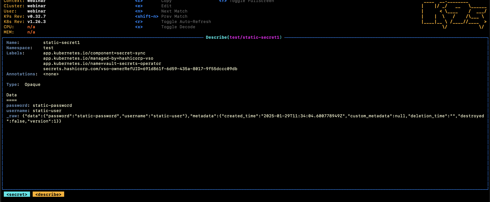
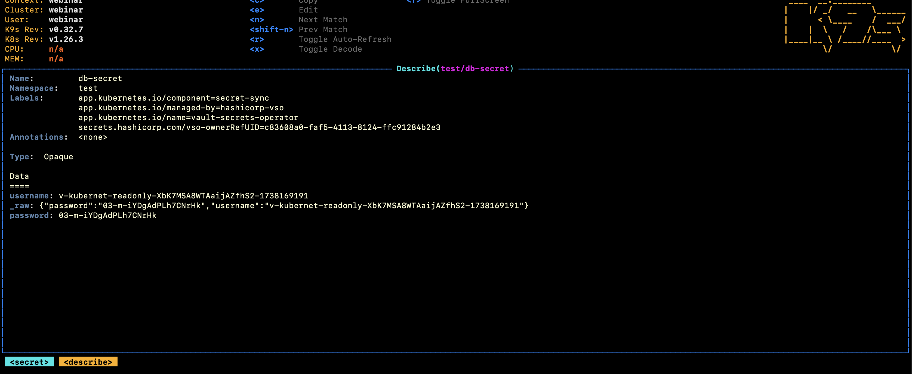
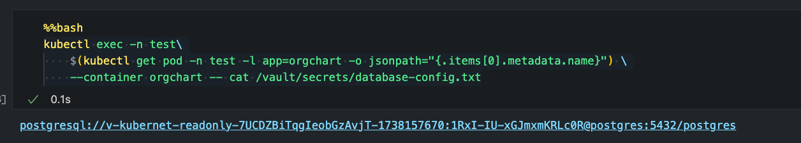

# Vault en Kubernetes - Webinar

## Prerequisitos

* Podman
* Python 3.9
  * dotenv
* Jupyter Notebook
* k9s

## Introducción

Este repo contiene una serie de Jupyter notebooks muestran los pasos para desplegar:

1. Un clúster de Vault en minikube (sobre Podman). El despliegue usando Helm, también incluye los componentes necesarios para hacer las integraciones usando el CSI Provider y Vault Agent Injector.
2. Desplegamos una base de datos postgres sobre minikube para mostrar la integración con secretos dinámicos.
3. Despliegue de VSO con secretos estáticos y dinámicos.
4. Vault agent con secretos dinámicos y templating.
5. CSI Provider con secretos dinámicos.

## Validación

Usando k9s:

* Accedemos al namespace test: ``:namespace``
* Accedemos a los secretos: `:secrets`

### VSO Secreto estático

* Seleccionamos el secreto `static-secret1` y seleccionamos la opción decode(`<x>`)

```yaml
apiVersion: secrets.hashicorp.com/v1beta1
kind: VaultStaticSecret
metadata:
  namespace: test
  name: example
spec:
  vaultAuthRef: vault-secrets-operator/example
  mount: kvv2
  type: kv-v2
  path: webapp/config
  refreshAfter: 60s
  destination:
    create: true
    name: static-secret1
```



### VSO Secreto Dinámico

* Seleccionamos el secreto `db-secret` y seleccionamos la opción decode(`<x>`)

```yaml
apiVersion: secrets.hashicorp.com/v1beta1
kind: VaultDynamicSecret
metadata:
  namespace: test
  name: db-secret
spec:
  vaultAuthRef: vault-secrets-operator/example
  mount: database
  path: creds/readonly
  destination:
    create: true
    name: db-secret
```



### Agent Injector

* Verificamos el secreto haciendo un exec al POD.

```yaml
      annotations:
        vault.hashicorp.com/agent-inject: 'true'
        vault.hashicorp.com/role: 'role'
        vault.hashicorp.com/agent-inject-secret-database-config.txt: 'database/creds/readonly'
        vault.hashicorp.com/tls-skip-verify: 'true' # Untrusted cert used here
        vault.hashicorp.com/agent-inject-template-database-config.txt: |
          {{- with secret "database/creds/readonly" -}}
          postgresql://{{ .Data.username }}:{{ .Data.password }}@postgres:5432/postgres
          {{- end -}}
```

```bash
kubectl exec -n test\
    $(kubectl get pod -n test -l app=orgchart -o jsonpath="{.items[0].metadata.name}") \
    --container orgchart -- cat /vault/secrets/database-config.txt
```



### CSI Provider

* SecretProviderClass type vault

```yaml
apiVersion: secrets-store.csi.x-k8s.io/v1
kind: SecretProviderClass
metadata:
  name: vault-database
  namespace: test
spec:
  provider: vault
  parameters:
    vaultAddress: "https://vault.vault.svc.cluster.local:8200"
    vaultSkipTLSVerify: "true"
    roleName: "role"
    objects: |
      - objectName: "db-username"
        secretPath: "database/creds/readonly"
        secretKey: "username"
      - objectName: "db-password"
        secretPath: "database/creds/readonly"
        secretKey: "password"
```

* Montamos el volumen dentro del POD.

```yaml
apiVersion: v1
kind: Pod
metadata:
  name: webapp
  namespace: test
spec:
  serviceAccountName: $ROLE_NAME
  containers:
  - image: nginx
    name: csi-pod
    volumeMounts:
    - name: secrets-csi
      mountPath: "/mnt/secrets-store"
      readOnly: true
  volumes:
    - name: secrets-csi
      csi:
        driver: secrets-store.csi.k8s.io
        readOnly: true
        volumeAttributes:
          secretProviderClass: "vault-database"
```

* Chequeamos el secreto montado en el POD

```yaml
kubectl exec webapp -i -t -n test -- cat /mnt/secrets-store/db-username 
echo "\n"
kubectl exec webapp -i -t -n test -- cat /mnt/secrets-store/db-password 
```
